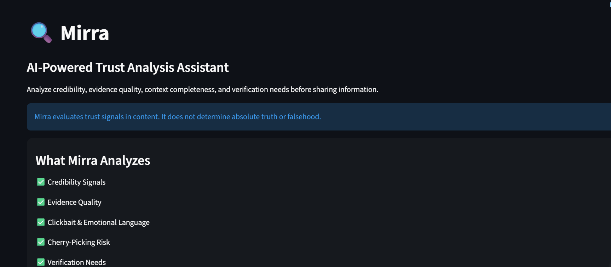
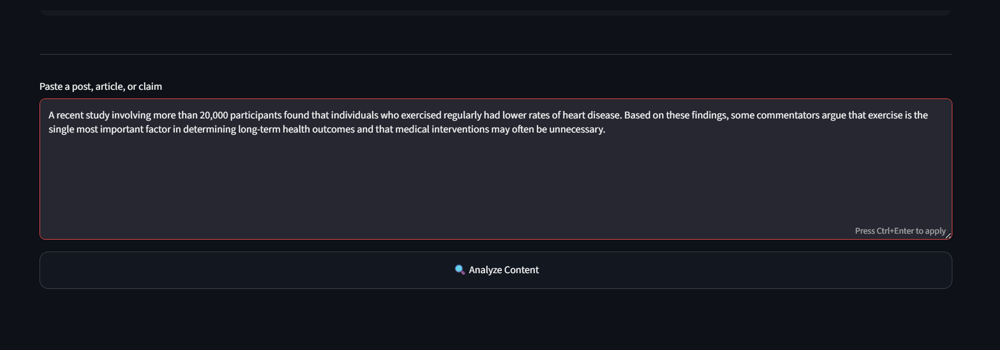
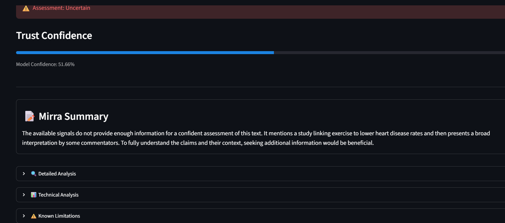
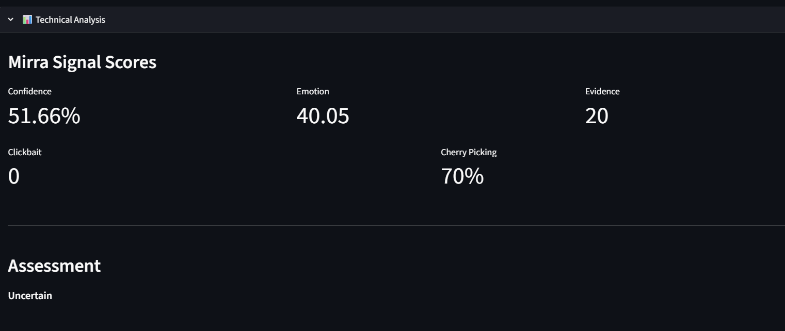

# Mirra – AI Trust Analysis Assistant

> 🚀 v0.1 Capstone Project developed during the IBM SkillsBuild × Edunet Foundation AI Internship Program.


Analyze credibility signals, evidence quality, emotional language, and verification needs before sharing information.

---

## Live Demo

🔗 https://mirra-ai.streamlit.app

---

## Overview

Mirra is an AI-powered trust analysis assistant designed to help users evaluate information critically before accepting or sharing it.

Unlike traditional fact-checking systems, Mirra does not attempt to determine absolute truth or falsehood. Instead, it analyzes trust-related signals such as:

- Credibility indicators
- Evidence quality
- Emotional language
- Clickbait patterns
- Context completeness
- Cherry-picking risk
- Verification needs

The objective is to encourage responsible information consumption and digital literacy.

---

## Features

- Machine Learning based trust assessment
- TF-IDF + Support Vector Machine (SVM)
- Emotion intensity analysis
- Clickbait detection
- Evidence signal detection
- AI-generated reasoning with Gemini
- Cherry-picking risk assessment
- Verification recommendations
- Transparent metric explanations
- Known limitations disclosure
- Public Streamlit deployment

---

## Screenshots

### Home Page



### Content Input



### Analysis Results



### Technical Analysis



---

## How Mirra Works

### 1. Machine Learning Layer

Input text is transformed into numerical features using TF-IDF vectorization.

A trained Support Vector Machine (SVM) model evaluates the content and produces:

- Initial assessment
- Confidence estimate

---

### 2. Trust Signal Extraction

Additional modules analyze:

- Emotional intensity
- Clickbait patterns
- Evidence-related language

These signals provide context beyond the ML model prediction.

---

### 3. AI Reasoning Layer

Google Gemini generates human-readable explanations for:

- Claim Detection
- Evidence Analysis
- Clickbait Analysis
- Cherry-Picking Analysis
- Verification Recommendations

This helps users understand why certain trust signals matter.

---

## Project Structure

```text
models/
├── svm_model.pkl
└── tfidf_vectorizer.pkl

utils/
├── clickbait.py
├── emotion.py
├── evidence.py
└── gemini_analyzer.py

app.py
predict.py
train_model.py
requirements.txt
README.md
```

## Technologies Used

- Python
- Streamlit
- Scikit-learn
- TF-IDF Vectorization
- Support Vector Machine (SVM)
- Google Gemini API
- VaderSentiment
- NumPy
- Joblib

---

## Metrics Explained

### Confidence

Represents how confident the ML model is in its assessment.

Source:
Derived from the SVM decision score using a sigmoid transformation.

### Emotion Score

Measures emotional intensity in language.

Source:
Calculated using VADER Sentiment Analysis.

### Clickbait Score

Measures attention-grabbing or sensational language patterns.

Source:
Keyword and phrase-based clickbait detection rules.

### Evidence Score

Measures the presence of evidence-related indicators.

Source:
Detection of references such as studies, reports, research, surveys, data, and cited findings.

### Cherry-Picking Risk

Estimates whether information may be selectively presented without sufficient context.

Source:
Generated by Gemini based on contextual reasoning.

---

## Known Limitations

Mirra is a trust analysis tool and not a fact-checking system.

Current limitations include:

- Trustworthiness does not guarantee factual accuracy.
- Some claims require external verification.
- The ML model was trained on a limited dataset.
- Domain-specific claims may require expert review.
- AI-generated explanations may occasionally miss important context.
- Scores should be interpreted as indicators rather than final judgments.

Users should treat Mirra as a decision-support tool rather than an authority on truth.

---

## Project Status

### Current Version: v0.1

Mirra is currently available as an early public prototype (v0.1).

This version was developed as the capstone project for the IBM SkillsBuild × Edunet Foundation AI Internship Program.

The primary goal of v0.1 is to demonstrate a practical trust-analysis workflow that combines:

- Machine Learning based assessment
- Trust signal extraction
- AI-generated reasoning
- User-friendly transparency features

While the application is fully functional and publicly deployed, it should be considered an initial release rather than a finished product.

Future versions will focus on:

- Web-assisted verification
- Source credibility analysis
- Improved evidence detection
- Larger training datasets
- Better contextual reasoning
- Multi-language support

Feedback and contributions are welcome as the project continues to evolve.

## Future Improvements

- Web-assisted verification
- Source credibility analysis
- URL and article analysis
- Multi-language support
- Larger training datasets
- Improved evidence detection
- Real-time source retrieval

---

## Author

Sunita Satpathy – Artificial Intelligence Intern, IBM SkillsBuild × Edunet Foundation

Developed as an AI and Machine Learning project focused on improving information evaluation, critical thinking, and digital literacy.